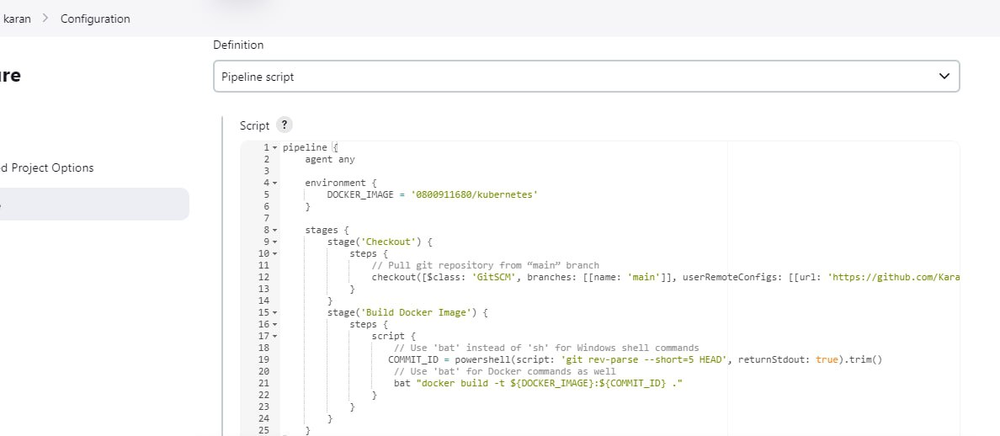
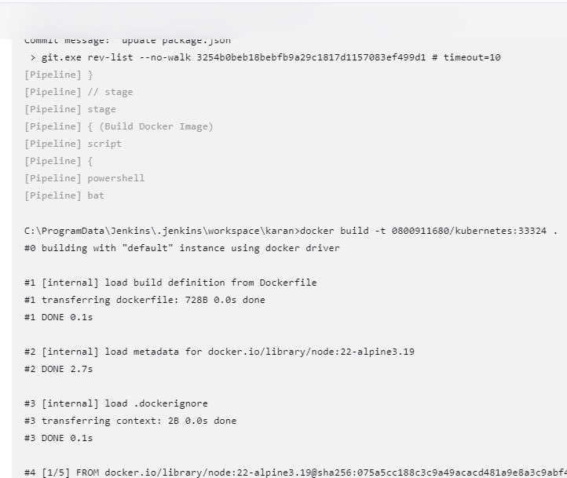
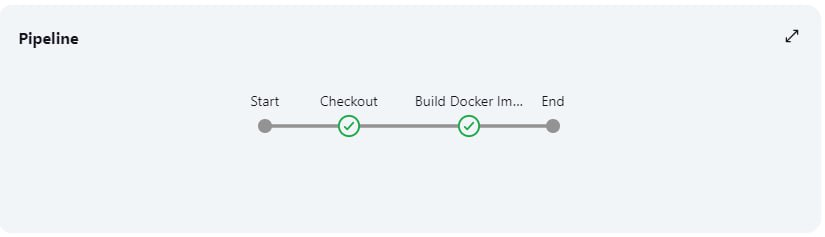

1. **สร้าง** Jenkin pipeline

   
2. กำหนด environment DOCKER_IMAGE
3. กำหนด state "Checkout" branches,userRemoteConfig
4. กำหนด "state Build Docker Image" ประกาศตัวแปร COMMIT_ID= ตัด commit id 5 ตัวแรกและใช้คำสั่ง build image
5. ทดสอบ build now

   
