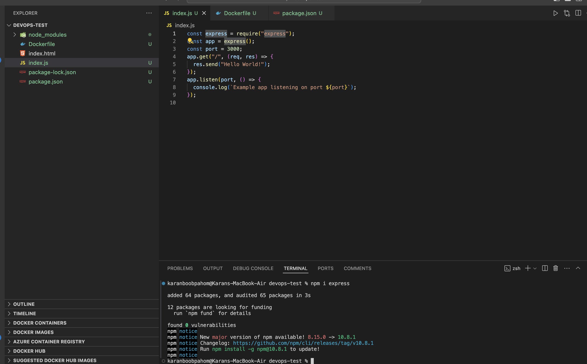
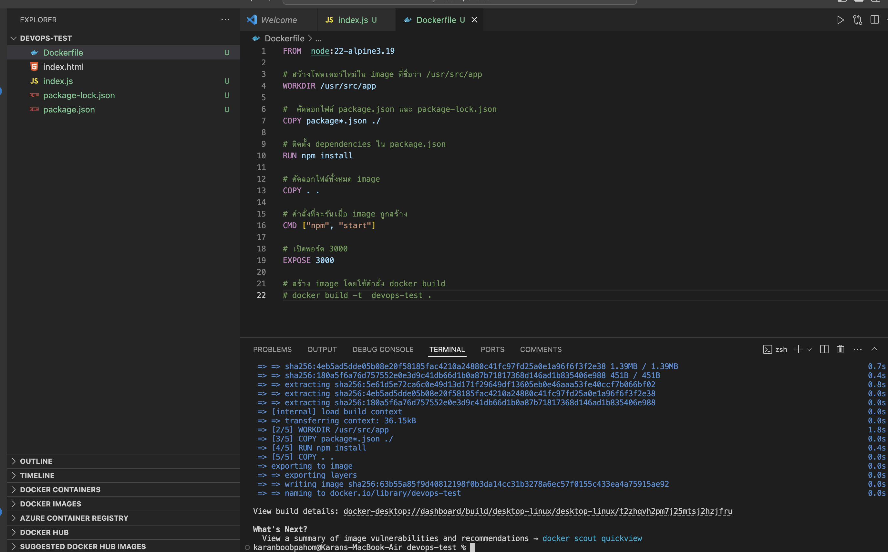
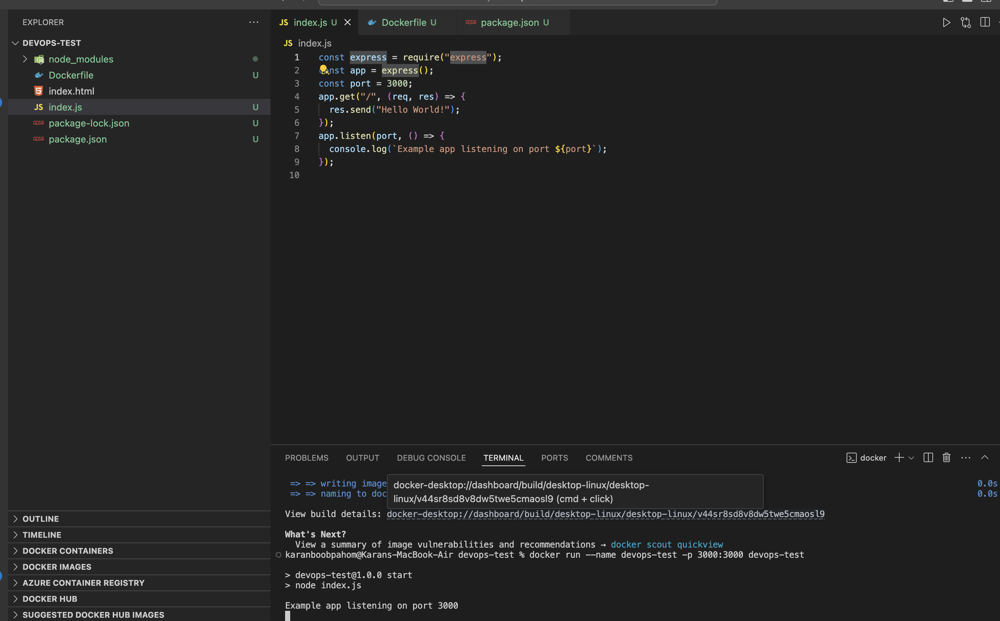
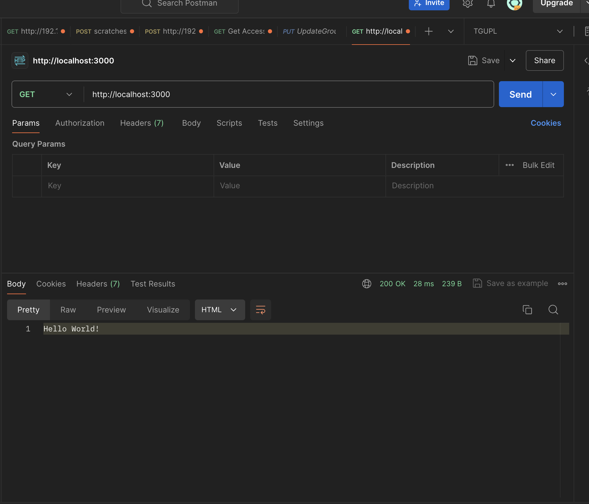

1. สร้างไฟล์ index.js
2. npm init เพื่อสร้างไฟล์ package.json ชื่อโปรเจ็ค เวอร์ชั่น คำอธิบาย
3. Npm I ที่ใช้ในการติดตั้งแพ็คเกจในไฟล์ json
4. สร้าง Dockerfile เขียนคำสั่งสำหรับ build image
5. สร้าง image จากคำสั่ง
6. ใช้คำสั่ง run docker run —name dev-test -p 3000:3000 dev-test
7. ทดสอบ request method get ไปที่ http://localhost:3000
