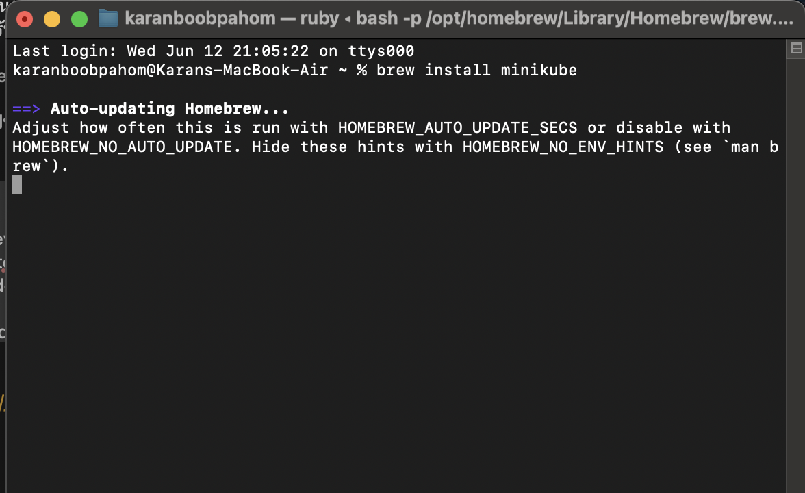
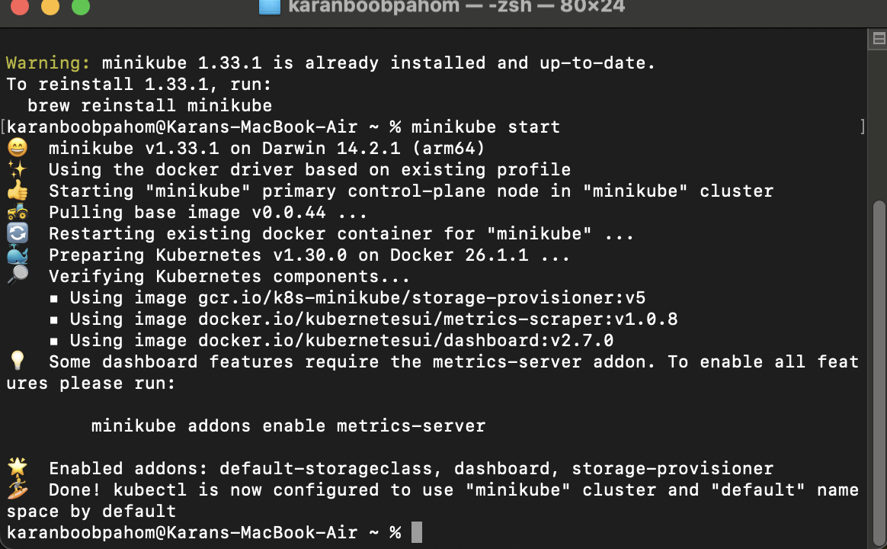
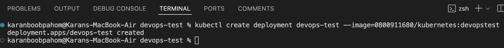
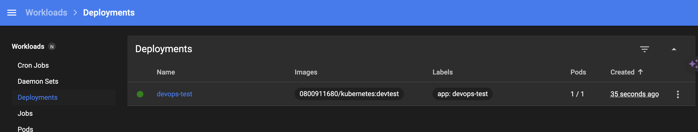

1. ติดตั้ง minicube
2. คำสั่งเริ่ม minikube start
3. docker push เพื่อเข้าใช้งาน docker repository
4. สร้าง deployment ชื่อ devops-test: kubectl create deployment devops-test --image=0800911680/kubernetes:devtest

   
5. สร้าง nodeport: kubectl expose deployment devops-test --type=NodePort --port=3000
6. forward port เพื่อทดสอบ: kubectl port-forward service/devops-test 3000:3000

   
7. เช็ค error จาก dashbord
8. ทดสอบ request method get ไปที่ http://localhost:3000
